# Quantum Optimization of Antenna Tilt - Real OpenCelliD Data

*QAOA, VQE and Grover on a 6-antenna, 12-qubit statevector simulation (QUBIT 2026 / Quantum Headache)*

Every number and plot below is produced by the verified pipeline in wolfram_realdataset_algorithms.wl (same directory). The first cell runs it end to end (~60-80 s, VQE dominates) and leaves all states and results in the kernel; the remaining cells only visualize them. Cost(t) = t.I.t - lambda c.t + mu sum(t) with lambda = 1.5, mu = 0.3; tilt levels 0..3 per antenna.

## 1. Run the verified pipeline

```mathematica
projDir = ParentDirectory[NotebookDirectory[]];
Get[FileNameJoin[{NotebookDirectory[], "wolfram_realdataset_algorithms.wl"}]];
```

```text
instance: 6 antennas, 12 qubits, dim 4096
classical optimum: cost = -2.844  tilts = {0, 3, 0, 0, 0, 0}
grid pre-scan best: <C> = 3.256379475328619 at (g,b) = {0.05, 1.2}
QAOA p=1: <C> = 1.9985331436763962  P(opt) = 0.006600532112109536  (0.8750000000000004 s)
QAOA p=2: <C> = -0.3825084348179876  P(opt) = 0.008723009473874593  (1.7039999999999997 s)
VQE:      <C> = -2.7674999999999894  P(opt) = 7.450089763660738*^-48  most likely tilts = {3, 0, 0, 0, 0, 0} (cost -2.7674999999999996)  (72.093 s)
Grover (2-antenna slice): optimum cost -2.844  tilts = {0, 3}, best k = 3  P(opt) = 0.9613189697265625  (random-baseline P = 0.0625)
written: C:\Projects\Hackton\verification\results\wolfram_realdataset_algorithms.json
```

## 2. Cost landscape of all 4096 tilt configurations

Exact enumeration. The optimum is a single configuration; a uniform random guess sits at the mean (~35.5).

```mathematica
Histogram[costVec, 60, "Count", PlotRange -> All, Frame -> True,
 FrameLabel -> {"Cost(t)", "number of tilt configurations"}, ChartStyle -> LightBlue, ImageSize -> 600,
 GridLines -> {{{minCost, Directive[Red, Thick]}, {Mean[costVec], Directive[Gray, Dashed]}}, None},
 PlotLabel -> Row[{"red = optimum ", minCost, " at tilts ", tilts[First[optIdx] - 1],
   ";  dashed = mean of uniform sampling ", NumberForm[Mean[costVec], {4, 1}]}]]
```

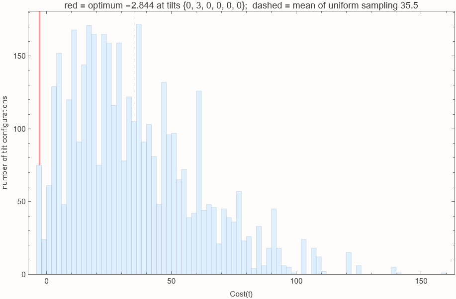

## 3. QAOA p=1 parameter landscape  <C>(gamma, beta)

The expected cost after one phase + one mixer layer. Most of the surface is a flat plateau at the mean; the optimizer (black dot) sits in the narrow low-cost valley near small gamma.

```mathematica
DensityPlot[qaoaP1[g, b], {g, 0, 0.3}, {b, 0, Pi},
 PlotPoints -> 25, MaxRecursion -> 0, ColorFunction -> "TemperatureMap",
 PlotLegends -> BarLegend[Automatic, LegendLabel -> "<C>"],
 FrameLabel -> {"gamma (phase angle)", "beta (mixer angle)"}, ImageSize -> 500,
 Epilog -> {Black, PointSize[Large], Point[{p1res["gamma"], p1res["beta"]}],
   Text[Style["NMinimize optimum", Black, 12], {p1res["gamma"], p1res["beta"]}, {-1.15, 0}]}]
```

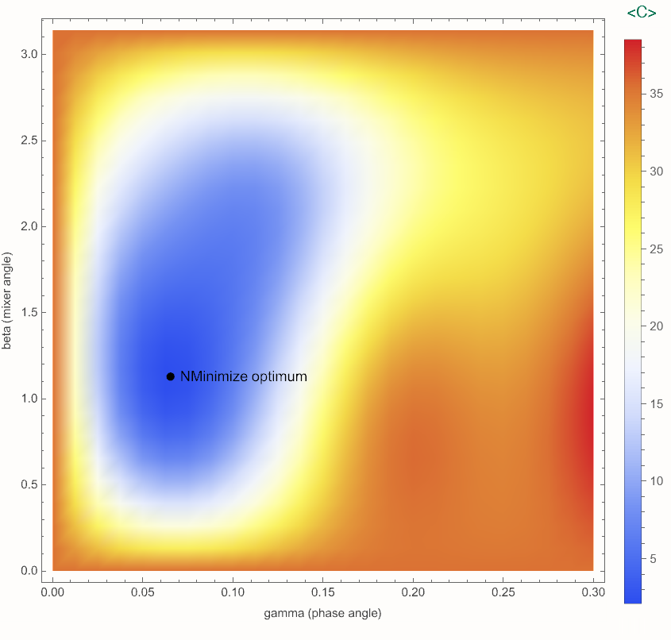

## 4. Where does the probability go?

Each dot is one of the 4096 basis states, placed at its cost. Uniform sampling is flat at 1/4096; QAOA moves weight to the low-cost side, and depth 2 moves more than depth 1.

```mathematica
ListPlot[{Transpose[{costVec, probs[hInit]}], Transpose[{costVec, probs[psiP1]}],
  Transpose[{costVec, probs[psiP2]}]},
 PlotStyle -> {Gray, Blue, Red}, PlotLegends -> {"uniform", "QAOA p=1", "QAOA p=2"},
 Frame -> True, FrameLabel -> {"cost of basis state", "sampling probability (log)"},
 ScalingFunctions -> {None, "Log"}, PlotRange -> All, ImageSize -> 600,
 GridLines -> {{{minCost, Directive[Darker@Green, Dashed]}}, None}]
```

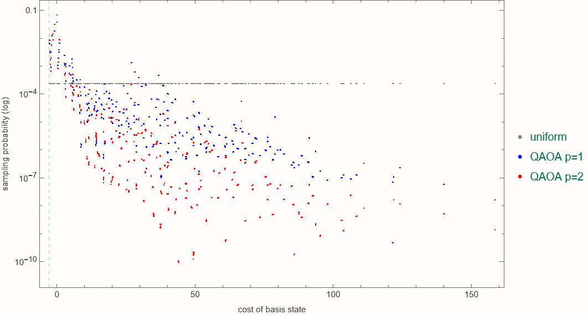

Compact metric for the pitch: the probability that one shot returns a configuration with negative cost (i.e. coverage gain beats interference + tilt penalty).

```mathematica
pNeg[psi_] := Total[Pick[probs[psi], Negative[costVec]]];
BarChart[{pNeg[hInit], pNeg[psiP1], pNeg[psiP2], pNeg[psiVqe]},
 ChartLabels -> {"uniform", "QAOA p=1", "QAOA p=2", "VQE"}, ChartStyle -> "Pastel",
 Frame -> True, FrameLabel -> {None, "P(cost < 0) per shot"}, ImageSize -> 500,
 LabelingFunction -> (Placed[NumberForm[100 #, {3, 1}] "%", Above] &)]
```

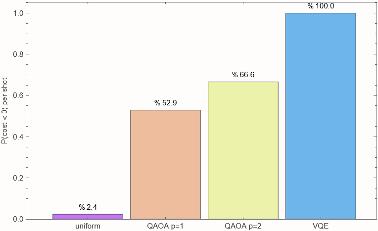

## 5. Most likely tilt configurations sampled from QAOA p=2

```mathematica
top = Ordering[probs[psiP2], -10];
Grid[Prepend[Table[{tilts[i - 1], NumberForm[costVec[[i]], {5, 3}],
    Row[{NumberForm[100 probs[psiP2][[i]], {4, 2}], " %"}]}, {i, top}],
  Style[#, Bold] & /@ {"tilts (antennas 1..6)", "cost", "P(sample)"}],
 Frame -> All, Alignment -> Left, Spacings -> {2, 0.6}]
```

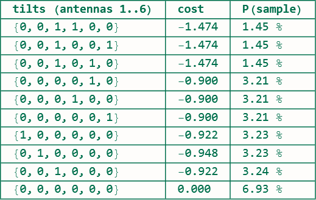

## 6. VQE convergence (RY+CZ ansatz, 3 Nelder-Mead restarts)

Every cost-function evaluation of each restart. The ansatz can represent the exact optimum, but Nelder-Mead in 24 dimensions settles in near-optimal local minima - a fair picture of real VQE behavior.

```mathematica
ListLinePlot[vqeTraces, PlotRange -> {All, {minCost - 1, 40}}, Frame -> True,
 FrameLabel -> {"cost-function evaluation", "<C>"},
 PlotLegends -> Table["restart " <> ToString[s], {s, Length[vqeTraces]}],
 GridLines -> {None, {{minCost, Directive[Red, Dashed]}}}, ImageSize -> 600,
 PlotLabel -> Row[{"dashed red = exact optimum ", minCost, ";  best VQE = ", vqeres["expected_cost"]}]]
```

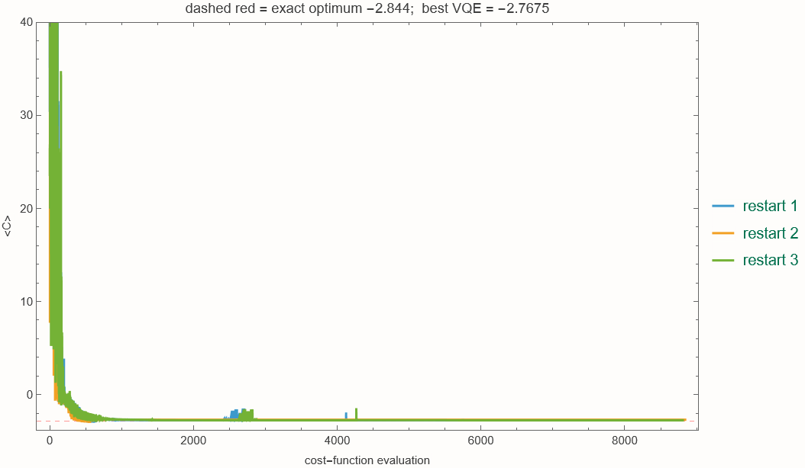

## 7. Grover amplitude amplification on the 2-antenna slice (16 states)

Durr-Hoyer style search with the optimum marked. One marked state in 16: P(opt) peaks at k = 3 (floor(pi/4 * sqrt(16))), then over-rotates at k = 4.

### How this is computed - and what a quantum computer would add

No quantum hardware is used anywhere in this notebook. All four algorithms, Grover included, are exact statevector simulations on a classical CPU, the same status as the Classiq QAOA runs of this project (Classiq and IonQ simulators). The 2-antenna slice has 4 qubits, so the state is a 16-element vector. The script builds two 16 x 16 matrices - the oracle (diagonal, -1 on the optimum state, +1 elsewhere) and the diffusion operator 2|u><u| - I that reflects about the uniform state - and one Grover iteration is the product psi -> diffusion . oracle . psi. Starting from uniform amplitude 1/4, each iteration rotates amplitude into the marked state; after k = 3 iterations its probability is 96 %. This is exactly the linear algebra a quantum computer would perform, executed with explicit matrices. It stays cheap here because 16 (or 4096 for the full 12-qubit instance) dimensions are tiny; classical simulation stops being feasible around 30-40 qubits, which is where real hardware becomes necessary.

Important distinction for the judges: this cell demonstrates amplitude amplification, not search. The oracle marks the optimum because we already computed it classically. A real Grover / Durr-Hoyer search needs an oracle circuit that, for any input tilt configuration, evaluates Cost(t) in qubits and flips the phase when Cost(t) < threshold, with the threshold lowered adaptively. Classiq can synthesize such a comparator from a Python cost function, but the circuit is deep - dozens of ancilla qubits and thousands of gates even at 12 qubits - well beyond what today's noisy devices execute faithfully. That is why QAOA is the primary algorithm of this project: its circuit is shallow and hardware-friendly, and the 12-qubit p=1 circuit can be run on IonQ/IBM through the existing Classiq pipeline. Grover's quadratic speedup is real only asymptotically; we present it as what becomes possible at scale, verified here by simulation.

```mathematica
BarChart[gsweep[[All, 2]], ChartLabels -> ("k = " <> ToString[#] & /@ gsweep[[All, 1]]),
 ChartStyle -> "Pastel", Frame -> True, FrameLabel -> {"Grover iterations", "P(optimum)"},
 GridLines -> {None, {{N[Length[opt2]/dim2], Directive[Gray, Dashed]}}}, ImageSize -> 500,
 LabelingFunction -> (Placed[NumberForm[#, {3, 3}], Above] &),
 PlotLabel -> "dashed = random baseline 1/16"]
```

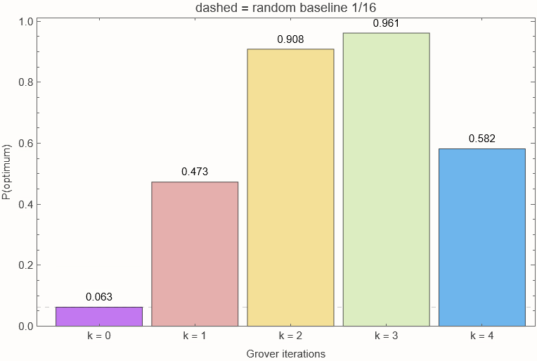

```mathematica
psi3 = Nest[diff.(marked.#) &, N[uni], 3];
BarChart[Abs[psi3]^2,
 ChartLabels -> Table[StringRiffle[tilts[i][[1 ;; 2]], ","], {i, 0, dim2 - 1}],
 ChartStyle -> {Table[If[MemberQ[opt2, i], Red, LightBlue], {i, 1, dim2}]},
 Frame -> True, FrameLabel -> {"tilts (antenna 1, antenna 2)", "probability after k = 3"}, ImageSize -> 600]
```

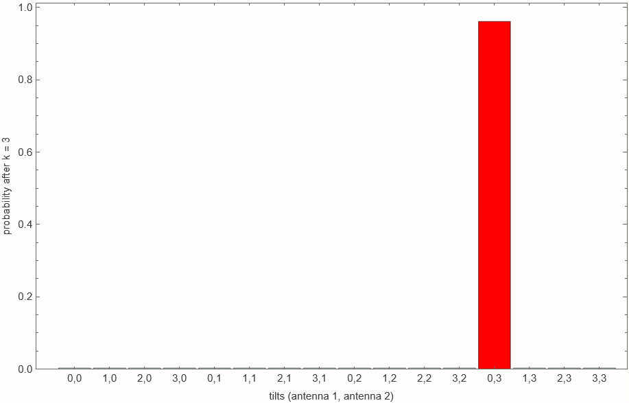

## 8. Summary

```mathematica
Grid[{Style[#, Bold] & /@ {"method", "<C>", "P(optimum)", "P(cost < 0)"},
  {"uniform random", expectCost[hInit], probOfOptimum[hInit], pNeg[hInit]},
  {"QAOA p=1", p1res["expected_cost"], p1res["p_optimum"], pNeg[psiP1]},
  {"QAOA p=2", p2res["expected_cost"], p2res["p_optimum"], pNeg[psiP2]},
  {"VQE (best of 3)", vqeres["expected_cost"], vqeres["p_optimum"], pNeg[psiVqe]},
  {"exact optimum", minCost, 1, 1}}, Frame -> All, Alignment -> Left, Spacings -> {2, 0.6}]
```

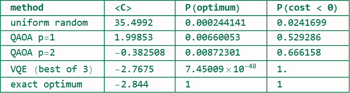

Results are also exported to verification/results/wolfram_realdataset_algorithms.json by the pipeline.

## 9. The real network: sites, sectors and the tilt plan

Real OpenCelliD tower positions (MCC 425, Tel Aviv): 2 sites, 3 sectors each, azimuths 0/120/240. Each wedge is one antenna, colored by its tilt level. Left: do-nothing baseline (all tilts 0, cost 0). Right: the optimum found by exact enumeration and targeted by the quantum samplers. The plan tilts exactly one sector - the one with the largest coverage gain (0.832) - because any second tilted sector on the same site pays the 1.35 co-site interference coupling.

```mathematica
sitePos = rows[[All, {5, 6}]]; azim = rows[[All, 8]]; optT = tilts[First[optIdx] - 1];
tiltColor[t_] := Blend[{Darker@Green, Orange, Red}, t/3.];
wedge[{lat_, lon_}, a_] := Polygon[Prepend[
   Table[GeoDestination[GeoPosition[{lat, lon}], {Quantity[350, "Meters"], b}], {b, a - 40, a + 40, 10}],
   GeoPosition[{lat, lon}]]];
planMap[tv_, label_] := GeoGraphics[{
   Table[{EdgeForm[Black], Opacity[0.6], tiltColor[tv[[i]]], wedge[sitePos[[i]], azim[[i]]]}, {i, n}],
   Table[{Black, PointSize[Large], Point[GeoPosition[sitePos[[i]]]]}, {i, n}],
   Table[Text[Style["A" <> ToString[i - 1] <> " tilt " <> ToString[tv[[i]]], Bold, 10, Black, Background -> White],
     GeoDestination[GeoPosition[sitePos[[i]]], {Quantity[480, "Meters"], azim[[i]]}]], {i, n}]},
  GeoBackground -> "StreetMap", GeoRange -> {{32.066, 32.095}, {34.780, 34.815}},
  ImageSize -> 460, PlotLabel -> Style[label, 12]];
GraphicsRow[{planMap[ConstantArray[0, n], "baseline: all tilts 0   (cost 0)"],
  planMap[optT, "optimum tilt plan   (cost " <> ToString[minCost] <> ")"]}, ImageSize -> 950]
```

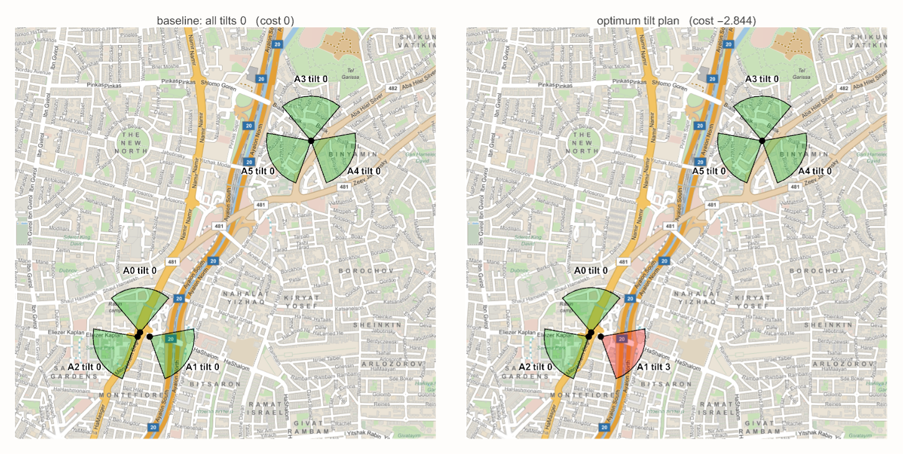

## 10. Gain decomposition: where the benefit comes from

Net gain = -Cost = coverage benefit (lambda c.t) - interference (t.I.t) - tilt penalty (mu sum t). The VQE plan tilts antenna 0 instead of antenna 1 and loses 0.0765 of gain - the 2.7 % difference in coverage gain between the two sectors.

```mathematica
plans = <|"baseline (all 0)" -> ConstantArray[0, n], "VQE most likely" -> vqeTilts, "exact optimum" -> optT|>;
gainParts[t_] := {lambda cvec.t, -t.imat.t, -mu Total[t], -cost[t]};
BarChart[gainParts /@ Values[plans],
 ChartLabels -> {Keys[plans], None},
 ChartLegends -> {"coverage benefit  lambda c.t", "interference  -t.I.t", "tilt penalty  -mu sum(t)", "net gain  -Cost"},
 ChartStyle -> {Darker@Green, Red, Orange, Blue}, Frame -> True, FrameLabel -> {None, "contribution to net gain"},
 LabelingFunction -> (Placed[NumberForm[#, {4, 3}], Above] &), ImageSize -> 700,
 GridLines -> {None, {0}}]
```

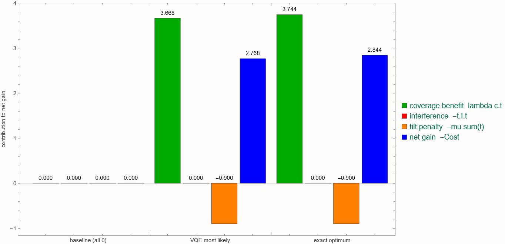

## 11. Gain from quantum sampling: shots needed to hit the optimum

A sampler with per-shot optimum probability P finds the optimum at least once in m shots with probability 1 - (1 - P)^m. QAOA raises P from 1/4096 to ~0.9 %, cutting the shots for 95 % confidence by ~35x.

```mathematica
pOpt = <|"uniform" -> probOfOptimum[hInit], "QAOA p=1" -> p1res["p_optimum"], "QAOA p=2" -> p2res["p_optimum"]|>;
shots95 = Ceiling[Log[0.05]/Log[1 - #]] & /@ pOpt;
LogLinearPlot[Evaluate[Table[1 - (1 - p)^m, {p, Values[pOpt]}]], {m, 1, 20000},
 PlotLegends -> Table[k <> "  (95 % at " <> ToString[shots95[k]] <> " shots)", {k, Keys[pOpt]}],
 PlotStyle -> {Gray, Blue, Red}, Frame -> True, ImageSize -> 650,
 FrameLabel -> {"number of shots m", "P(optimum sampled at least once)"},
 GridLines -> {None, {{0.95, Directive[Darker@Green, Dashed]}}}, PlotRange -> {0, 1}]
```

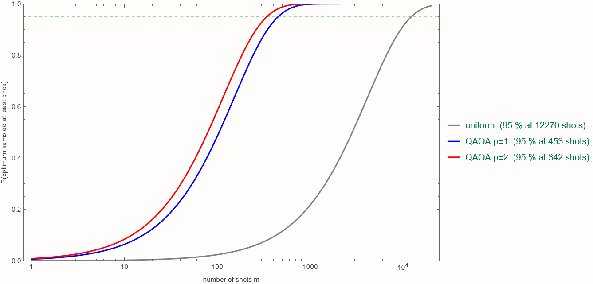

## 12. From 4 simulated tilt levels to the operator's 10

The 2-qubit-per-antenna encoding covers tilt levels 0..3. The operator-scale instance has 10 levels; its exact optimum (-8.532, brute force in data/oracle_tilt.py) lies on the same line: tilt antenna 1 only, as far as allowed. A 4-qubit encoding (16 levels) would reach it directly; the structure of the solution is already visible at 12 qubits.

```mathematica
oracle = Import[FileNameJoin[{projDir, "verification", "results", "opencellid_il2_oracle.json"}], "RawJSON"];
curve = Table[{t, cost[{0, t, 0, 0, 0, 0}]}, {t, 0, 9}];
ListLinePlot[curve, PlotMarkers -> {Automatic, 9}, Frame -> True, ImageSize -> 650,
 FrameLabel -> {"tilt level of antenna 1 (all others 0)", "cost"},
 Epilog -> {Red, PointSize[0.02], Point[Take[curve, 4]]},
 GridLines -> {None, {{oracle["optimum_cost"], Directive[Red, Dashed]}, {oracle["greedy_cost"], Directive[Gray, Dashed]}}},
 PlotLabel -> Column[{Row[{"red points = the 4 levels encoded in 2 qubits (optimum ", minCost, ")"}],
   Row[{"dashed red = 10-level exact optimum ", oracle["optimum_cost"], ";  gray = greedy ", oracle["greedy_cost"],
     " (gap ", NumberForm[oracle["greedy_gap_pct"], {3, 2}], " %)"}]}, Alignment -> Center]]
```

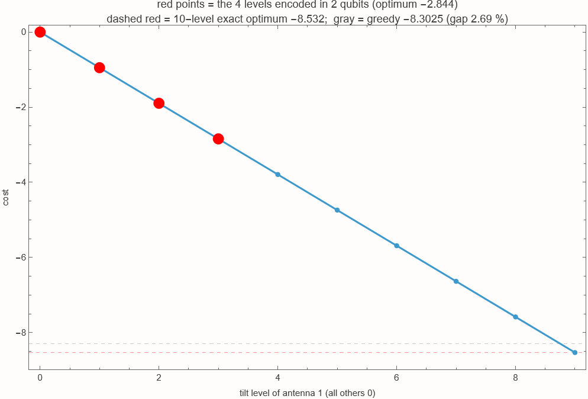
